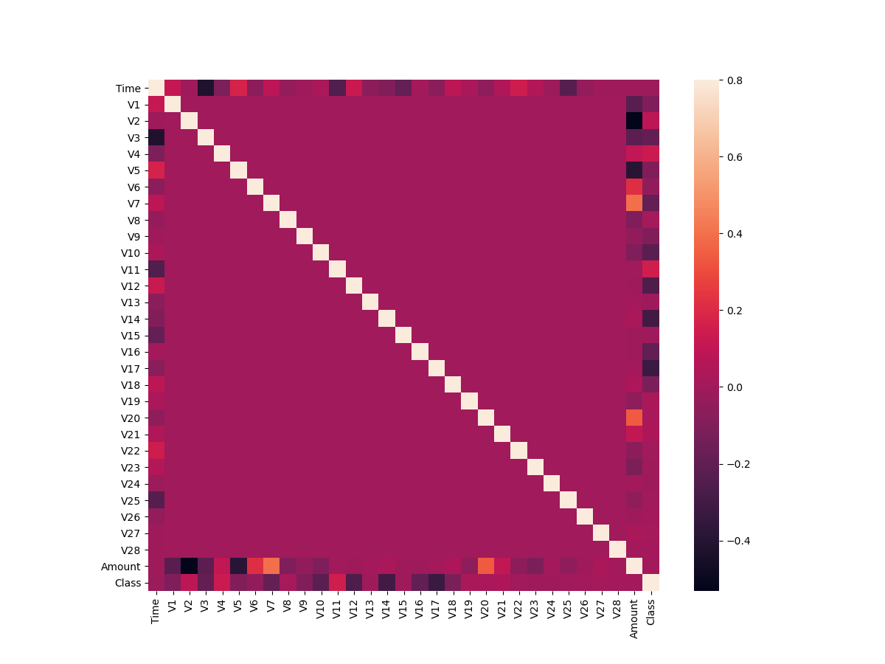

# Credit Card Fraud Detection using Machine Learning

basically a anamoly detection project 

two machine learning algorithms: Local Outlier Factor (LOF) & Isolation Forest Algorithm

## Exploring the dataset

Dataset used - [Credit Card Fraud Detection dataset on Kaggle](https://www.kaggle.com/mlg-ulb/creditcardfraud/version/3)

Loading the dataset as a pandas dataframe -
```python
import pandas as pd
data = pd.read_csv('creditcard.csv')
```

```
>>> data.shape()
(284807, 31)
```
So we have 284,807 credit card transactions with 31 columns. Let's see what are the columns in our dataset.

```
>>> data.columns()
Index(['Time', 'V1', 'V2', 'V3', 'V4', 'V5', 'V6', 'V7', 'V8', 'V9', 'V10',
       'V11', 'V12', 'V13', 'V14', 'V15', 'V16', 'V17', 'V18', 'V19', 'V20',
       'V21', 'V22', 'V23', 'V24', 'V25', 'V26', 'V27', 'V28', 'Amount',
       'Class'],
      dtype='object')
```
Great! Now we'll check general info about the dataset and also check if there's any data missing.
```
>>> data.describe()
                Time            V1  ...         Amount          Class
count  284807.000000  2.848070e+05  ...  284807.000000  284807.000000
mean    94813.859575  1.165980e-15  ...      88.349619       0.001727
std     47488.145955  1.958696e+00  ...     250.120109       0.041527
min         0.000000 -5.640751e+01  ...       0.000000       0.000000
25%     54201.500000 -9.203734e-01  ...       5.600000       0.000000
50%     84692.000000  1.810880e-02  ...      22.000000       0.000000
75%    139320.500000  1.315642e+00  ...      77.165000       0.000000
max    172792.000000  2.454930e+00  ...   25691.160000       1.000000
[8 rows x 31 columns]
```
The count value for each of the columns is same so there's no data missing. That's good. Let's go  ahead.

There are 30 features in total. There's time of transaction, amount of transaction and rest 28 features are a result of PCA dimensionality reduction algorithm. This is done so as to protect sensitive information about the transactions.

Let's plot a histogram for our data using
```
>>> data.hist(figsize=(30,30))
>>> plt.show()
```


As we can see from the histogram, the number of fraudulent transactions(Class label = 1) is very low. Let's find out the exact number and the ratio.

```
>>>fraud = data[data['Class']==1] #returns array of transactions labeled 1 (fraud)
>>>valid = data[data['Class']==0]#returns array of transactions labeled 0 (valid)

>>>print("Number of fraud transactions- ", len(fraud))
>>>print("Number of valid transactions- ", len(valid))
>>>print("Ratio of fraudulent transactions- ", len(fraud)/(len(fraud)+len(valid)))
```

```
Number of fraud transactions-  492
Number of valid transactions-  284315
Ratio of fraudulent transactions-  0.001727485630620034
```

So we can see that just 0.17% of the total transactions are fraudulent, i.e. just 492 from 284,315. So there's a huge disparity in the data.

Now, we will build a correlation matrix to see if there's any strong correlation between the features in our database. It'll tell us if there are any linear relationship in our data that we can use further to predict. We'll also find out what features in our data are important. We'll plot the correlation matrix and also use seaborn to convert it into a heatmap.

```
corrmat = data.corr()   
sns.heatmap(corrmat, square=True)
```

We can observe   